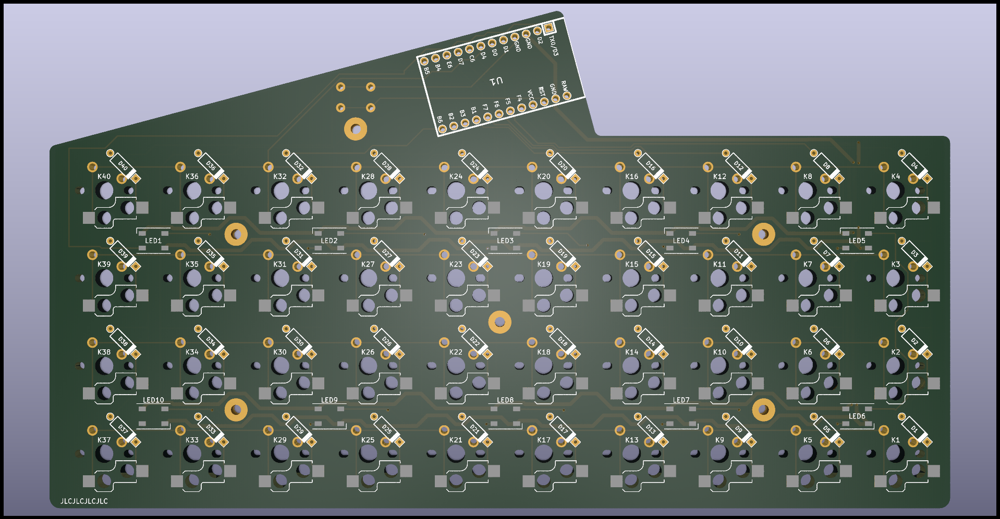

# RSlate
A 40key acrylic stack keyboard that is either hotswap with low profile switches or normal one but not hotswap.
Supports Vial
Currently Done!
---
|||
|---|---|
|Front|Back|
---
3d files are at [here](https://cad.onshape.com/documents/8e13d1f4745863165f092818/w/d03652fcd09787199e2b8651/e/c43cd68ad85962de6582dd97)
